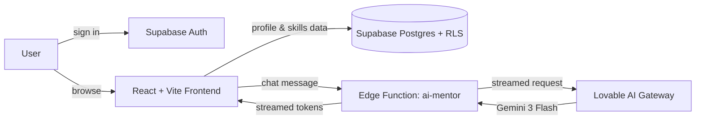

  
  
  
  

<a href="#-about-me">About</a> &nbsp;·&nbsp; <a href="#-currently">Currently</a> &nbsp;·&nbsp; <a href="#-featured-builds">Featured Builds</a> &nbsp;·&nbsp; <a href="#-other-projects">Other Projects</a> &nbsp;·&nbsp; <a href="#%EF%B8%8F-tech-stack">Tech Stack</a> &nbsp;·&nbsp; <a href="#-github-analytics">Analytics</a> &nbsp;·&nbsp; <a href="#-lets-connect">Connect</a>

 

## 🧑‍💻 About Me

I'm a second-year **B.Tech CSE** student at **KMEA Engineering College (Autonomous)**, Aluva — affiliated to KTU — currently in **S3**, also pursuing a **minor in Electronics (EC)**.

I like taking things past the tutorial stage: finishing a working app, writing down what it actually does (and doesn't do yet), and shipping the next version. Off the keyboard, I serve as **Class Representative** and **Junior Red Cross (JRC) Unit Leader**, and I'm active in **IEEE** and other technical communities on campus.

## 🌱 Currently

- 🏥 Building a **Smart Hospital Management System** — JavaFX + JDBC + MySQL, with a rule-based appointment-priority engine (Strategy/Observer patterns) — for my S3 OOP coursework *(in progress — repo coming soon)*
- ☁️ Working through **NPTEL Cloud Computing** (IIT Kharagpur, Prof. Soumya K. Ghosh) week by week
- 📈 Strengthening **DSA** and backend fundamentals ahead of internship applications
- 🎯 Targeting **software engineering internships**, with GATE CSE and MS-abroad kept open as longer-term tracks

## 🚀 Featured Builds

<table>
<tr>
<td width="100%">

### 🧠 Synapse — AI Career Intelligence Platform
**Team hackathon build · KAPRICIOUS'26, KMEA Engineering College — first hackathon, first year of college**

Built in ~12 hours with a 4-person team. Instead of reducing a candidate to a resume, Synapse builds a living profile (skills, goals, strengths) paired with an AI mentor and a fit-based matching layer for recruiters.

**Genuinely working:** email/password auth, profile + skills/education/experience persisted to Postgres behind Row-Level Security, and a live AI mentor chat streamed from Gemini 3 Flash.
**Still prototype:** the dashboard, roadmap, and recruiter views currently render from mock data rather than live queries — called out here rather than left for someone to discover later.

📎 [Live demo](https://muneeb-pt.github.io/SYNAPSE-mindspark/) · [Source](https://github.com/Muneeb-PT/SYNAPSE-mindspark)

</td>
</tr>
<tr>
<td width="100%">

### 📄 AutoDoc AI — Product Concept & Landing Page
**Course project · Engineering Entrepreneurs & IPR**

A startup-style MVP exploring an AI-powered documentation generator: the problem, the pitch, feature set, and pricing tiers, built as a polished landing page and UI (React + TypeScript + Tailwind + shadcn/ui, scaffolded with Lovable). This project was the entrepreneurship exercise — validating the idea and the UI, not shipping the backend — so the "engine" describes a planned architecture (repo analysis → LLM pipeline → generated docs) rather than a deployed one.

📎 [Live demo](https://autodoc-ai.lovable.app) · [Source](https://github.com/Muneeb-PT/AutoDoc-AI)

</td>
</tr>
</table>

## 🧪 Other Projects

| Project | What it is | Built with | Link |
|---|---|---|---|
| 🌦️ Weather App | API-driven, location-based weather lookup | React · Vite · Weather API | [Live](https://muneeb-pt.github.io/Weather_App/) · [Code](https://github.com/Muneeb-PT/Weather_App) |
| 🧮 Calculator | Responsive arithmetic calculator | HTML · CSS · JavaScript | [Live](https://muneeb-pt.github.io/Calculator/) · [Code](https://github.com/Muneeb-PT/Calculator) |
| 🪔 Diwali — Festival of Lights | First-year "Foundations of Computing" project | HTML · CSS | [Code](https://github.com/Muneeb-PT/Diwali-Festival-of-Lights) |
| 🌐 My First HTML Project | Class-12 site — first steps into web dev | HTML | [Live](https://muneeb-pt.github.io/MyFirst-HTML-project/) · [Code](https://github.com/Muneeb-PT/MyFirst-HTML-project) |

## 🛠️ Tech Stack

**Languages**

**Web & Frontend**

**Backend & Data**

**Tools**

## 📊 GitHub Analytics

> These cards use the shared public instances of `github-readme-stats` / `github-profile-trophy`, which occasionally rate-limit under heavy traffic — if a card ever shows blank, refresh, or see the setup note below on self-hosting.

## 🐍 Contribution Graph

*(Renders once the snake workflow below is added to this repo — see setup note.)*

## 🎯 Roadmap

| Now | Next | Later |
|---|---|---|
| DSA fundamentals · Java/JavaFX backend work · finish SHMS | First public open-source PR · a full-stack project with a real backend | Internship-ready portfolio · GATE CSE / MS-abroad prep |

## 🤝 Let's Connect

I'm interested in backend systems, full-stack builds, hackathons, and AI-assisted developer tools — open to internships, collaborations, and good first issues.

